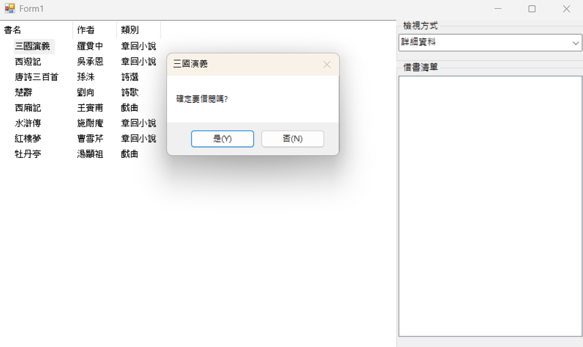

# BookListView - 互動式書籍檢視與借閱系統1133334楊恩奇

這是一個基於 C# Windows Forms (WinForms) 開發的互動式圖書瀏覽與借閱管理系統。專案核心利用 `ListView` 控制項展示多樣化的資料檢視模式（如大圖示、詳細資料等），並整合了 `ComboBox` 與 `ListBox` 提供直覺的互動操作。

## 功能特點

- **多模式檢視切換**：支援 5 種不同的 `ListView` 檢視風格（大圖示、詳細資料、小圖示、清單、拼貼）。
- **豐富的欄位資訊**：在「詳細資料」模式下，可完整檢視書名、作者及書籍類別。
- **圖示整合**：支援為每本書籍載入對應的影像（ImageIndex 整合）。
- **防重複借閱機制**：點擊書籍引發借閱確認，系統會自動檢查並防止重複將同一本書加入借書清單。

## 開發環境與技術

- **開發語言**：C# 12
- **框架技術**：.NET 6.0 / 8.0 或 .NET Framework (Windows Forms)
- **核心控制項**：
  - `ListView` (`lvwBooks`)：展示圖書核心資料與切換樣式。
  - `ComboBox` (`cmbView`)：提供檢視模式的下拉選單。
  - `ListBox` (`lstBorrow`)：收集並顯示使用者已借閱的書籍清單。

## 程式碼架構與邏輯說明

### 1. 基礎資料宣告
系統內部使用三個一維陣列儲存靜態圖書資料，陣列索引值相互對應：
- `b_name`：儲存古籍書名（如三國演義、西遊記等）。
- `author`：儲存對應的作者。
- `kind`：儲存圖書分類。

### 2. 視窗初始化 (`Form1_Load`)
- 初始化 `ComboBox` 下拉選單並設定預設選取項目。
- 動態為 `ListView` 建立「書名」、「作者」、「類別」三個表頭欄位。
- 利用 `BeginUpdate()` 與 `EndUpdate()` 暫停畫面重繪，優化大量資料載入時的效能。
- 透過迴圈動態建立 `ListViewItem`，並將作者、類別以 `SubItems` 形式加入，同時指派對應的圖片索引 `ImageIndex`。

### 3. 檢視樣式變更 (`cmbView_SelectedIndexChanged`)
透過 `switch-case` 結構監聽下拉選單的選擇變更，即時切換 `lvwBooks.View` 的屬性：
- `0` `View.LargeIcon` (大圖示)
- `1` `View.Details` (詳細資料)
- `2` `View.SmallIcon` (小圖示)
- `3` `View.List` (清單)
- `4` `View.Tile` (大圖示加詳細資料/拼貼)

### 4. 借閱觸發機制 (`lvwBooks_ItemActivate`)
- 當使用者**雙擊項目**或按 Enter 鍵觸發 `ItemActivate` 事件。
- 系統透過 `lvwBooks.SelectedIndices[0]` 取得當前選取書籍的索引並捕捉書名。
- 使用 `lstBorrow.Items.Contains()` 檢查該書是否已被借閱。
- 若未被借閱，跳出 `MessageBox` 進行二次確認，確認後方加入借書清單。

## 📖 操作說明

1. **切換檢視**：開啟程式後，可透過上方的下拉選單切換書籍的顯示方式（例如：點選「詳細資料」可看見作者與類別）。
2. **申請借閱**：在清單中**雙擊**任何一本書籍。
3. **確認借閱**：系統跳出「確定要借閱嗎？」提示框，點擊「是(Y)」後，該書籍將會出現在右側的已借清單中。
## Screenshots

